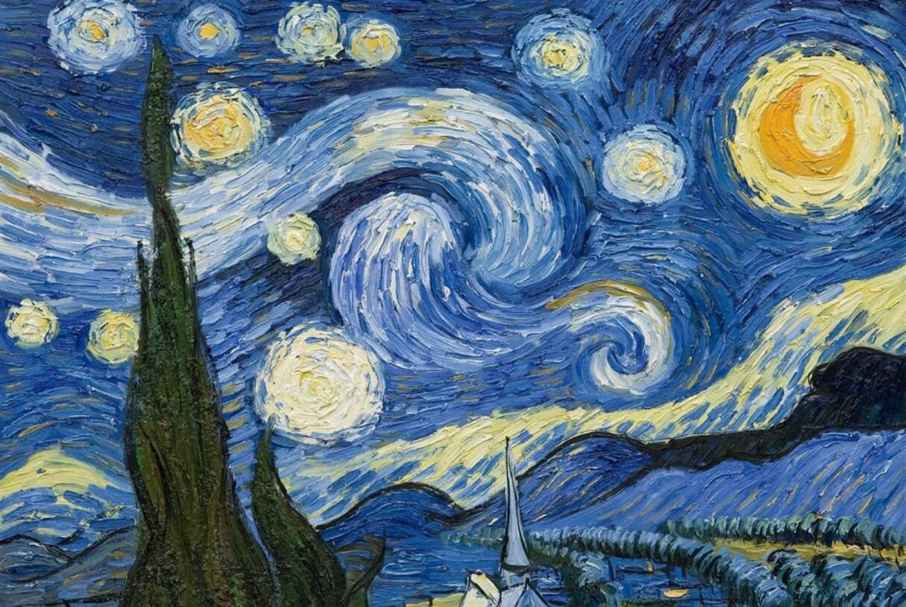

### 奇葩说辩题有感

### 支持全人类知识共享吗？

  这一的奇葩说的辩题着实不错，很有深度，但是这个题目似乎有些太大了。没有边际的东西是无法去摸索其形状的，或是说我们现有的最高上限还是过小，许多东西无法尽收眼底。

### 文明

  全人类算是一种规格的文明群体，而生存是文明的第一需求。好吧，这时我的思绪又转到何为“文明”了？那就思考思考文明。文明究竟是一种实实在在的物种形式存在，还是超越物质形式之外的某种东西。物种是文明的载体，还是文明孕育着物种。“给岁月以文明，而不是给文明以岁月”，大脑中想了许久，在我看来，文明应不是一种可用感官去感知的东西，或是说文明的核心本质是在物质层面之上的。我们所感知到的东西不过是高维在低维下的投影，我们也就只能观摩其边缘的风光，身为局内之人是无法看破这个局的。我相信当有人顿悟的那一刻，一个全新的世界便会随之而来，当然这种可能微乎其微。不，这或许并不能称之为“可能”，我们只能掷一次硬币，要么是正，要么是反。微观到小到无限还是没能看得透，你说，是谁设了这么一场游戏，他又是在将这场游戏展示给谁看。上帝，你的规则到底是什么…

  再想下去就要进入一个无底深渊了，停下吧，有生之年，还会有时间想下去的。

### 人类的出路

  我是谁？我从哪里来？我要到哪里去？

  我们要到哪里去？要去完成一个怎样的结局？每每想的这里我总是无限的悲愤，我们所有的人都会死在前进的路上，我们都无法走到这条路的终点，甚至说连看都看不到这终点的模样。就像被玩弄在股掌之间的那种感觉，极其难受。这条路，囊括了我们的一生，所有人的一生。好在有一丝光亮始终悬在众人的头顶，但这一丝光亮不知能否一直陪同着众人。

  也许我们应该去探寻我们的来处，要不然什么基本的信念都没有存在的依据，仅仅依靠“活下去”这么一句空荡荡的话语。众人就真的可以都活下来吗？在众人思想还未完全形成时就有了不少的例子，当人类的思想都统一到达某个境界时，恐怕是…

  出路不在未来，而是掩藏在已经过去的岁月之中。被时间所掩着的，恐怕是我们始终都没想到的。

至此搁笔

  思绪每每在星海中遨游之后归于现实，我都有些怀疑这所谓的现实到底是什么东西。这种种形式之下的，为何?

