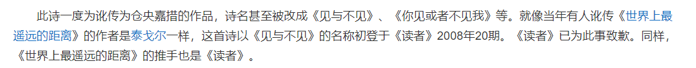

静坐时回忆起了些以前没来由的事，脑海中一瞬间闪过“无端么”这个词。又仔细往下想了想，大概是高中时读的一首诗，诗的名字就叫“无端么”。记不清作者和具体的内容，遂打开浏览器输入了这几个字。

无端么，出自扎西拉姆多多，又继续看了看关于扎西拉姆多多的作品，班扎古鲁白玛的沉默—这则诗的内容在很多地方看到过，却很少关注到作者的署名以及诗题，以下是原文：

```
班扎古鲁白玛的沉默
扎西拉姆·多多

你见，或者不见我
我就在那里
不悲 不喜
你念，或者不念我
情就在那里
不来 不去
你爱，或者不爱我
爱就在那里
不增 不减
你跟，或者不跟我
我的手就在你手里
不舍 不弃
来我的怀里
或者
让我住进你的心里
默然 相爱
寂静 欢喜

```
似乎某部电视剧还将这首词谱曲作成了首歌，顺着百科页面往下翻发现这首诗还曾有过一段争议，《读者》误将其当成仓央嘉措的作品在某一期的杂志中登出了。如果单看内容的话，这首诗和仓央嘉措作品的某些译本文风确实有些相仿。

那位雪域的王，转山转水转佛塔

继续往下看，发现了一段同样意思的文字，《世界上最遥远的距离》的作者不是泰戈尔。依稀记得这首诗我高中时曾抄录在摘抄本上，题尾的署名正是泰戈尔。发现竟然不是他的作品，错认了好久，此刻很是抱歉



综上，我们所处的世界太大了，除去物质本身还有其相互错杂的网络连接，众多的因素综合到一起，一个人很难保证其认知永远不出一点差错。我们总是要对自己进行纠正的，只有这样才能保持自身有一个相对正确的价值判断。


回到《无端么》

多少羽翼纷纷  多少花笑频频