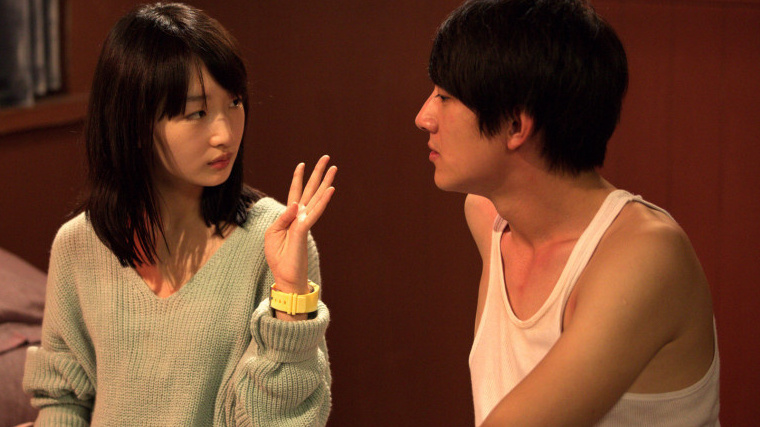
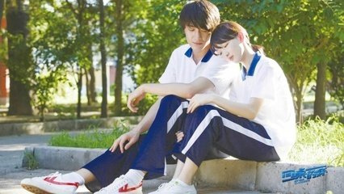

# 明天的你是否会想起，昨天你写的日记

&emsp;&emsp;接近一周的生产实习是终于结束了，我也有时间放松放松了。趁着上午还有大把时间，寻思着就把脑海中的一个印象拿出来回味回味，那是部我在很久很久之前看过的电影。尽管其情节遭无数人诟病，我又去翻了翻豆瓣上的影评，更是惨不忍睹。但我还是决定看看，看看这整体框架之下的不同之处。似曾是在三年前看过的，那是大概是还处于懵懂时期，只是无尽的疑问，心里涌过一些悲伤，但不知是为何。我愤愤不平，也无数次重复着“到的是现实打败了我们”。让两个相爱的人彼此分开，这是多么可恨。

# 现如今再看那些情景，会有什么不同呢?

&emsp;&emsp;年少时似乎总是充满活力的，我们肆无忌惮的向这个世界表达自己的想法。我爱上了上一刻的蓝天，这一刻的阳光，以及下一刻的你。

&emsp;&emsp;我很羡慕那种从小到大延续不断的感情，她可能不是最好的，但是是我曾经最想接触的。初中稍稍有些幼稚，不适合心智发展。那个时候是畸形的世界观，人生观。似乎这一切都是被发生的，谁也变该不了什么。好感是一种很奇妙的东西，你也不知道什么时候它就来了。要么藏着掖着，要么就公之于人。

&emsp;&emsp;高中在我看来是最美好的一段时光。（可能是现有体制下的特有情况，总之就是我们被安排了，你不得不接受的）正常情况下都有着近乎健全的三观，美好的事物来了一般都不会抗拒。男女之间还是有着纯洁的友谊的，这是我拿反证法得出的结论。至于现在看出的为何都是那般的不纯，大概是前提被限制，所处的格局太小所致。没有什么纯洁，也没有什么不纯洁，灵魂的共鸣少之又少，众人也就企图从肉体上的接触寻找那一丝线索。

&emsp;&emsp;爱不是过程，爱也不是目的，它是游离于这两者之外更高层级的象征。我似乎有些超脱现实，但我还是希望它可以朝着这个方向前进。不，其必将朝着这个方向前进，你我是无法阻止的，只需要等待时间的脚步到来即可。

&emsp;&emsp;很正常，对于彼此来说。人有时又不敢超越现实，哪怕那个东西仅仅是微乎其微的一点改变，众人不愿意，众人也不敢，众人也只不过是一个小小的人。她都已经做出过妥协，更何况这一次不是妥协，只是需要一点点勇气。你没变，我没变，那为何还不敢继续前行呢？我不懂人性如何，也就不去思考她的内心波澜，再说我也不是她。故事里的她早已不是单一的一个她，那是遗憾，青春...混在一起的她

&emsp;&emsp;十六岁的你，十六岁的我，十六岁的她，又有谁可以将生活中的每一样都换成自己喜欢的？我们总是被决定了一切。

&emsp;&emsp;后来一切都已成定局？什么是定局呢？

&emsp;&emsp;没有什么是一直不变的，当世人一遍又一遍的说着不重样的誓言时，时间这个老人有在背后偷笑，它见证过无数誓言的破灭。运动是永恒存在的，你我的不变也只能是相对的不变。倘若你还爱着那个人，又何须怕什么呢?你大可像初次相识那样再执拗一回。婚姻不是枷锁，不是每个人都要留下一点牵绊。灵魂没有忠诚，限制了自由其就失去了本质。要么坚定不移，要么换种方式。

# 过往的过往，每个人都有相应的模样

&emsp;&emsp;人一生下来就已经决定了这一生，死亡是一种形式的消失，谁也不知道闭眼后的世界。爱是苦味的药剂，喝不喝都没什么大不了。这世界不只是男人女人，那不过是一种形式表达。我喜欢清风明月，它们倒是没有什么变化，我也没有什么变化，仅仅是喜欢着。

&emsp;&emsp;我现在释怀了许多，这麽一说仿佛我的过往有多么悲伤一般。人们在岔口选择了无数次，终于到达了自己心心念念的地方。而我在选择了一些之后便转过身朝起点走过去了。人生有无限种可能，因为一个人而把自己锁死在这一种可能上，确实很了不起，但我不喜欢。

&emsp;&emsp;好像瞎敲了好久的字，思想可能还没缓过来吧。说说实习。工厂里的机器一点感情都没有，不知疲倦的重复着那单一的动作。反观我们众人，不也是这样吗？所谓的感情不过是懵懂无知。我们也在机械化的推进着一切。

不喜欢

青春总是无处安放
未来只能不断想象
你我终将悲喜散场
人生不过热血满腔

读书看报，吃饭睡觉。
我们道不破天机，只能慢慢学习

